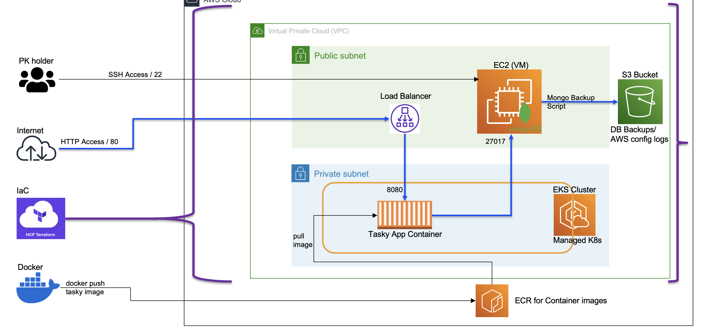

# Terraform AWS Infrastructure for MongoDB & Web Application

This repository contains a Terraform configuration to deploy a cloud-based infrastructure for a MongoDB database server and a web application hosted on an EKS cluster. It is designed to use AWS services, providing scalability, reliability, and automation.

## Features

### VPC and Networking
- **Custom VPC** with private and public subnets across 3 availability zones.
- **NAT Gateways** to enable secure outbound internet access for private subnets.
- Security groups to control access for the database, load balancer, and other components.

### MongoDB Database Server
- Deploys an **EC2 instance** configured with MongoDB.
- Automated **daily backups** to an S3 bucket with lifecycle policies for retention.
- Configured with secure access and authentication.

### Web Application
- **EKS cluster** hosting the web application.
- **Managed node groups** for scalable compute resources.
- Integrated with a Kubernetes-managed **LoadBalancer** for public access.

### IAM and Security
- Custom **IAM roles and policies** for S3 access and EC2 management.
- Enforces security best practices through least privilege access and lifecycle policies.

### S3 Bucket
- Dedicated S3 bucket for MongoDB backups.
- Versioning and lifecycle rules to manage storage effectively.

## Prerequisites
- [Terraform](https://developer.hashicorp.com/terraform/downloads) v1.3 or later.
- AWS credentials configured in your environment.
- A public SSH key for EC2 access.

## How to Deploy

### Step 1: Clone the Repository
```bash
git clone <repository-url>
cd <repository-directory>
```

### Step 2: Update Variables
Define your variables in a terraform.tfvars file or export them as environment variables:
```hcl
region       = "us-west-2" # Update with your desired region
public_key   = "ssh-rsa AAA..." # Your public SSH key
private_key  = "..." # Path to your private SSH key (for provisioning)
```

### Step 3: Initialize Terraform
```hcl
terraform init
```

### Step 4: Plan the Deployment
```hcl
terraform plan
```

### Step 5: Apply the Configuration
```hcl
terraform apply
```
Confirm with yes when prompted.

### Step 6: Access the Resources
MongoDB server: Access via SSH using the EC2 instance's public IP.
Web application: Use the load balancer's DNS name to access the application.
Cleanup

### To destroy all resources created by this configuration, run:
```hcl
terraform destroy
```

### Notes
Ensure your AWS account has sufficient permissions to create the required resources.
Update the MongoDB credentials and web application secrets as needed for production use.
Regularly review and optimize resource usage to minimize costs.

### Architecture Diagram
